# 1 字典和枚举的使用

在校开发项目的时候，像是职位、性别、文件类型等标识类数据都是通过枚举在Java程序中定义的，但这就带来了弊端，如果要扩展这些标识类的数据，就不得不去修改程序，然后重新打包重新上线，这不免对未来的维护带来了弊端。

在使用小诺框架后大量使用到了“字典”，像是职位、性别、名族等都是存在字典库中的，如果需要就可以在系统管理界面中通过字典管理功能，增删改查字典，这样如果未来需要扩展“职位”的标识数据，就可以直接在字典管理系统中对key=职位的字典项中新增value即可。

## 1.1 是什么

Java中字典(Dictionary)和枚举(Enum)是两种不同的数据类型。

### 1.1.1 字典

**字典**是一种键值对(key-value)映射的数据结构，可以通过键(key)来获取相应的值(value),常用的实现类包括Hashtable、HashMap、TreeMap等。字典可以存储任意类型的值，而且键必须是唯一的。

字典管理是在项目系统中用于管理和维护一组固定的数据值的过程。它可以用于存储和维护在项目过程中使用的不同类型的数据，例如状态、类型、分类等。**在确定好字典结构后可以持久化到数据库中，用数据库系统管理数据字典。**

### 1.1.2 枚举

**枚举**是一种特殊的数据类型，它用于定义一组预定义的常量。每个枚举常量都是枚举类型的一个实例，枚举常量在声明时就已经确定了，不能再更改。枚举类型可以有方法和属性，可以实现接口，但不能被继承。

## 1.2 区别

在使用上，字典通常用于存储任意类型的数据，而枚举用于限制变量的取值范围，增加程序的可读性和可维护性。

这两个数据结构都可以描述“状态”常量，比如星期这个字段可能有星期一、星期二...星期天，那数据字典和枚举应该如何挑选呢？哪些“状态”描述应该使用数据字典，哪些状态描述应该选择枚举？

- 如果“状态”和业务完全无关，仅仅描述用例的一种状态，且后期会改变。比如说性别为男、女，系统内只是标注一下，不会因为性别为男，就会产生其他的业务，这种就适合用数据字典保存，持久化在数据库中；
- 如果“状态”和业务有关，比如订单的状态为计划、审批、下发，但是每种状态的业务逻辑不一样，且后期可能会新增加入其它的状态，那这种就适合枚举类型存储；
- 枚举类型和代码相关，枚举状态版本和代码版本一一对应，不会应该数据库内容改变就改变，非常适合某些耦合性较强的业务；

- 使用枚举类不需要查表，速度更快，但是状态常量值发生改变的话，就需要改变项目的枚举类中的代码，重新打包项目并发布。若是存在数据库中的数据字典则不需要改动代码，写sql增添查改就可以了。

# 2 实例
## 2.1 snowy系统
以小诺系统李的数据字典管理为例。

如下是小诺系统的字典表结构：
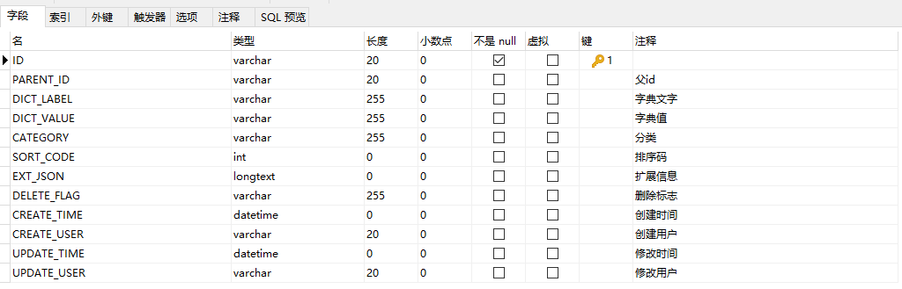
最主要的字段是`PARENT_ID`、`DICT_LABEL`、`DICT_VALUE`、`CATEGORY`。
- `CATEGORY` 主要是分类字典的使用场景，是在系统中使用还是在业务中使用。

在创建字典时，会让先选择字典的层级，也就是父id是谁。如果是顶层的字典，也就是父id为0，这时创建的数据字典就会成为“字典分类标识”一般的存在。而后就可以在字典分类下创建具体的字典项，以`DICT_VALUE`为具体值，`DICT_LABEL`为字典文字标识。

如下所示，先创建一个文件类型的字典，并设置为顶层：
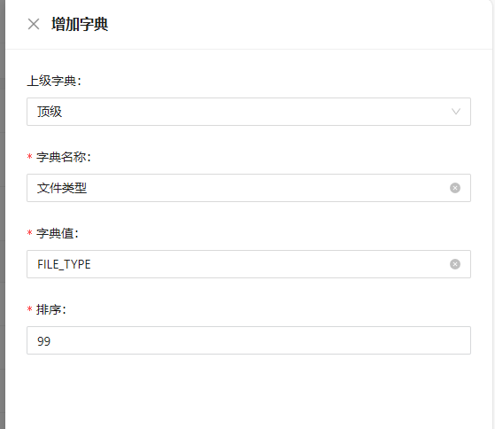
之后再设置两个父id为“文件类型”数据字典的id的子数据字典：
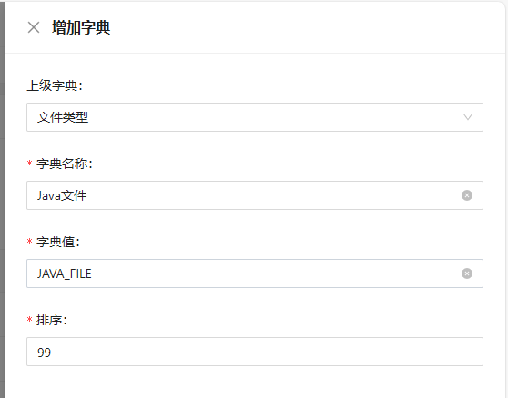
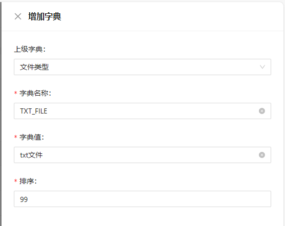

之后就可以通过顶层的“文件类型”数据字典，选择其两个子项“Java文件”和“txt文件”。

通过如下SQL就可以查询到刚刚新建的“文件类型”分类的数据字典了：
```sql
SELECT ID,PARENT_ID,DICT_LABEL,DICT_VALUE,CATEGORY FROM dev_dict WHERE PARENT_ID = 0;
```

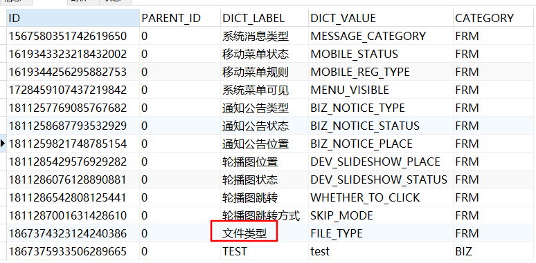

### 具体实现

**根据小诺系统中如下编辑用户功能，查看具体实现：**
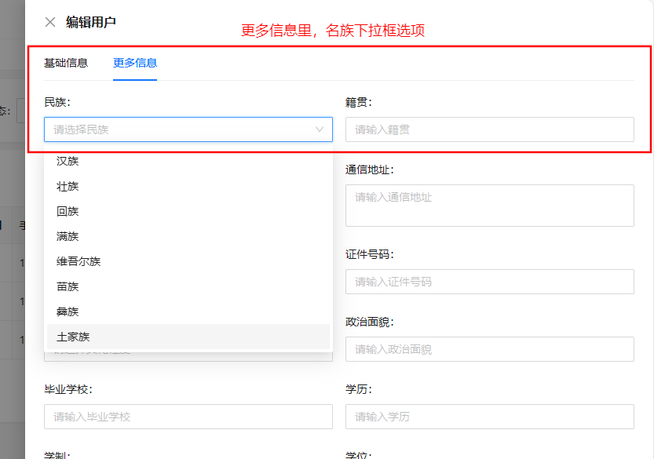

1. 启动系统的时候将数据库中的字典项以树结构先全部缓存到浏览器localStorage中
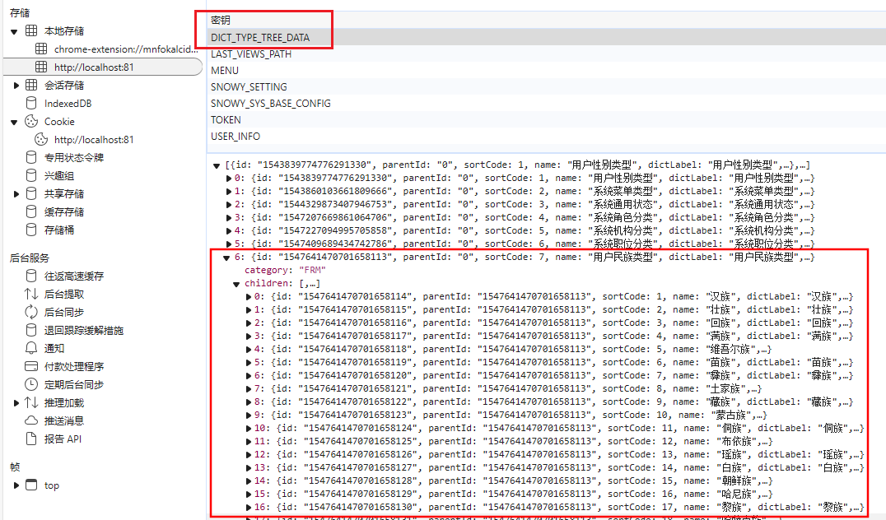
2. 再在多选框中通过绑定数据字典列表，提供下拉框的多选项：
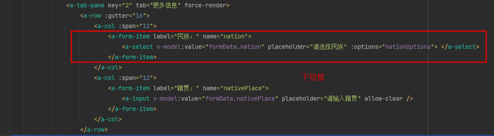
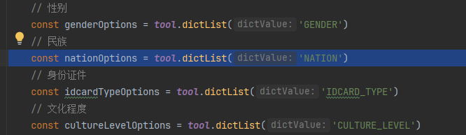
3. 通过DICT_VALUE获取指定分类（树的叶子节点：就是子节点里的children数组）的数据字典列表。其中，dictValue是具体值，name是选择项的显示文字
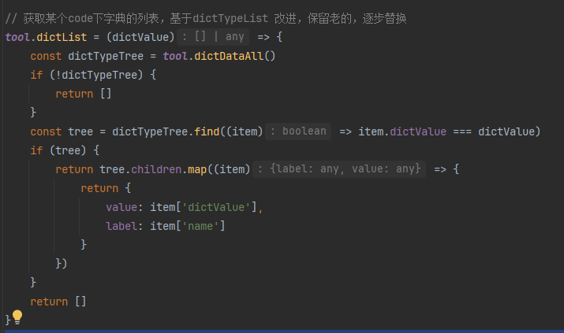
4. 获取的指定分类前会先从localStorage中获取的所有数据字典的树型结构数据
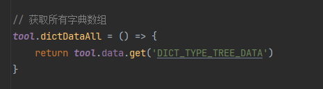
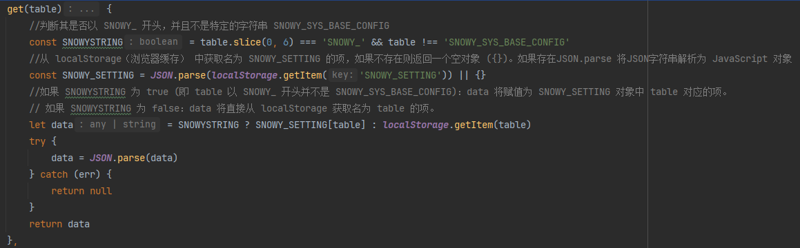
### 思考

小诺框架里这种启动系统后就将所有字典加载到浏览器缓存中真的好吗？如果更新了数据库中的字典数据岂不是要再次向浏览器缓存里更新数据？感觉多此一举，不如直接存在数据库中就是了。

如果只存在数据库中可能在频繁选择数据字典的时候会给数据库带来压力，所以缓存在浏览器中可以缓解数据库查询的压力，但为啥不用redis？减轻自己的压力，给用户上压力是吧？怪不得启动一次系统要好几秒。
## 2.2 诺伊系统

以若依系统里的数据字典管理为例。

这里以`sys_dict_type`表为键，以`sys_dict_data`表为值，通过`dict_type`字段为key，value就是通过`dict_code`字段为唯一标识、`dict_label`字段为描述值、`dict_value`字段为具体值等组合成的复杂值。从而实现字典管理。

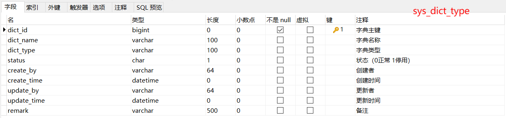

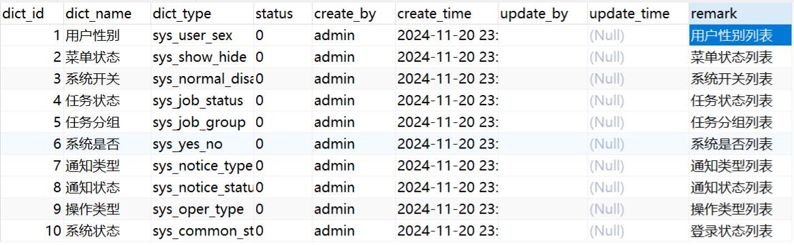


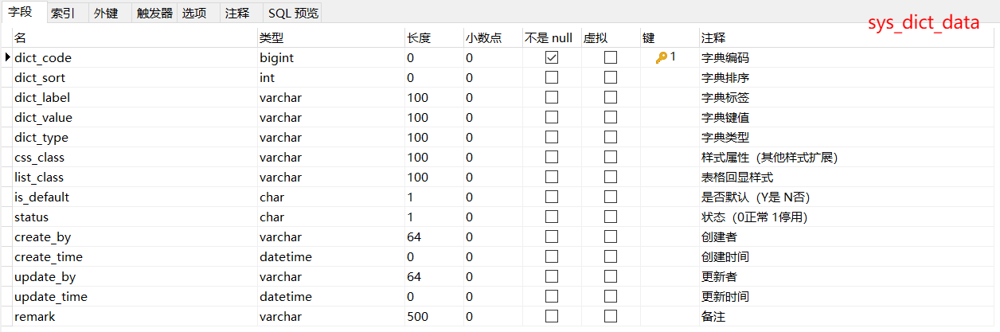

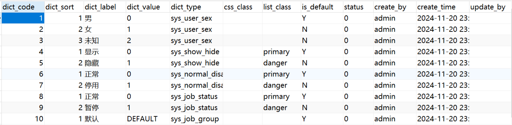

在更新用户的性别时，会先从`sys_dict_data`表中获取键为`sys_user_sex`的数据值，也就是符合`dict_type=sys_user_sex`的数据行。然后在页面中显式`dict_label`字段。确定修改后就会将`dict_value`的值赋给用户信息的sex字段中。

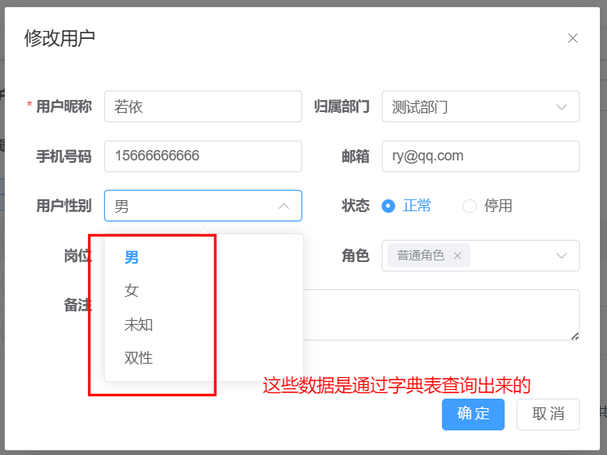

```json
{
    "msg": "操作成功",
    "code": 200,
    "roleIds": [
        2
    ],
    "data": {
        "createBy": "admin",
        "createTime": "2024-11-20 23:21:38",
        "updateBy": null,
        "updateTime": null,
        "remark": "测试员",
        "userId": 2,
        "deptId": 105,
        "userName": "ry",
        "nickName": "若依",
        "email": "ry@qq.com",
        "phonenumber": "15666666666",
        "sex": "0",	//sex字段里存储的是dict_value
        "avatar": "",
        "password": "$2a$10$7JB720yubVSZvUI0rEqK/.VqGOZTH.ulu33dHOiBE8ByOhJIrdAu2",
        "status": "0",
        "delFlag": "0",
        "loginIp": "127.0.0.1",
        "loginDate": "2024-11-20T23:21:38.000+08:00",
        //......
}
```

