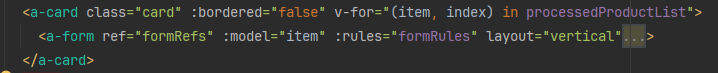

# 1 如何对一组v-for动态生成的form进行模板引用
从vue官网找到了答案。
## `v-for` 中的模板引用[​](https://cn.vuejs.org/guide/essentials/template-refs.html#refs-inside-v-for)

- 需要 v3.2.25 及以上版本

当在 `v-for` 中使用模板引用时，对应的 ref 中包含的值是一个数组，它将在元素被挂载后包含对应整个列表的所有元素：

```vue
<script setup>
import { ref, useTemplateRef, onMounted } from 'vue'

const list = ref([
  /* ... */
])

const itemRefs = useTemplateRef('items')

onMounted(() => console.log(itemRefs.value))
</script>

<template>
  <ul>
    <li v-for="item in list" ref="items">
      {{ item }}
    </li>
  </ul>
</template>
```

- 3.5 前的用法

```vue
<script setup>
import { ref, onMounted } from 'vue'

const list = ref([
  /* ... */
])

const itemRefs = ref([])

onMounted(() => console.log(itemRefs.value))
</script>

<template>
  <ul>
    <li v-for="item in list" ref="itemRefs">
      {{ item }}
    </li>
  </ul>
</template>
```

应该注意的是，ref 数组**并不**保证与源数组相同的顺序。
>所以不能在对顺序有严格要求的场景下使用。

# 2 如何验证所有动态生成的form表单项
## 2.1 问题引出

因为有一个表单组件是通过v-for动态生成的，后面我用模板引用获取到了那些动态生成的表单DOM，但是需要将所有表单都验证成功了才发送提交数据请求，将表单数组作为请求参数。



>点击添加按钮，就会往processedProductList中添加元素，也就是封装表单数据的对象，同时就会通过v-for循环生成`<a-form>` 

rules是可以在输入的时候显示数据是否符合规则，但是即使表单显示不符合规则的红色字样但还是可以提交表单信息。

所以要用到validate()函数：
```js
  formRef.value
    .validate()
    .then(() => {
      console.log('验证通过');
    })
    .catch(error => {
      console.log('验证失败');
    });
```

但是这里检验表单验证是是否通过是一个异步函数，用async/await又没法获取到是否验证成功的结果。使用then()链式调用又是异步的，不会等验证结果就会执行后面提交的请求了。

## 2.2 解决问题
遍历所有模板引用，然后加一个通过验证的计数变量。

循环遍历formRefs[i].value.validate()验证那些表单是否都符合规则，符合规则则计数变量加1，全部遍历完成后计数变量的值等于表单总个数，则表示全部符合规则，就提交数据。

```js
// 提交按钮点击事件  
const submitLoading = ref(false);  
const handleSubmit = () => {  
    //验证成功次数  
    let successCount = 0;  
  
    for (let i = 0; i < formRefs.value.length; i++) {  
       formRefs.value[i].validate().then(res=>{  
          console.log('验证成功',res);  
          successCount++;  
          //当成功次数等于表单总数，表示所有表单都验证成功，则提交  
          if (successCount === formRefs.value.length){  
             //提交请求  
             submitData();  
          }  
       }).catch(err=>{  
          console.log(err,'验证失败');  
       })  
    }  
  
	console.log(`正确数${successCount}，总表单数为${formRefs.value.length}`);  
};
```
