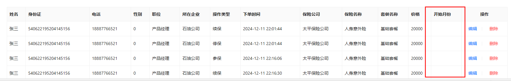
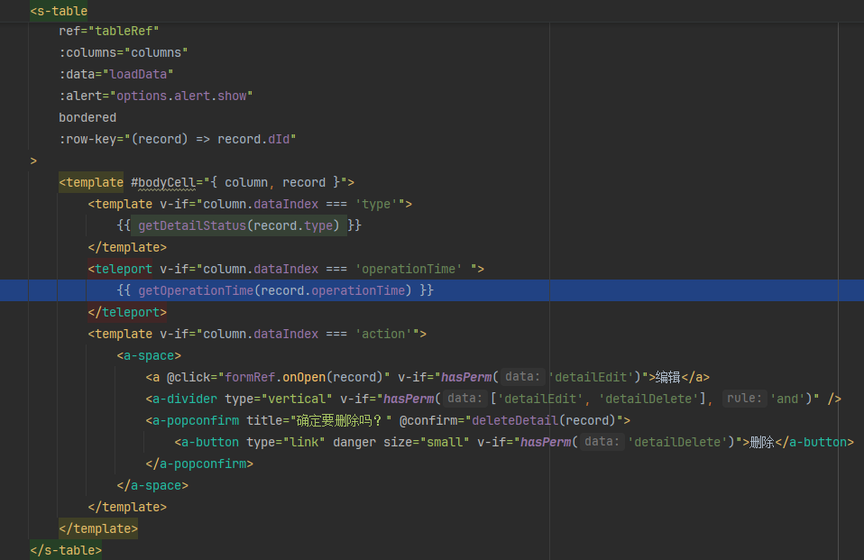

异步获取数据后，需要在表格组件中显示，这里就有一项日期数据，每个详情表中都会有日期数据，我需要将其格式化为`YYY-MM` 的格式，但我定义了一个格式化函数，接收一个时间参数，并返回格式化后的时间字符串，结果却无法在页面中显示，不管使用计算属性还是啥，都没用。

最后只能在发送请求的函数中，通过then()方法在成功请求后获取响应数据，在js代码中格式化后重新赋值给日期项数据，达到显示到页面中的数据是符合`YYY-MM`格式的。

我想应该是因为那些数据是异步显示的，在页面加载后js代码中定义的格式化函数并没有获取到需要被格式化前的日期数据，所以无法将格式化后的数据显示到页面中。但是我也给有给格式化函数定义如果参数为空就返回`"无"`，不应该什么都不显示啊？

最后得到这两个异常：
`[Vue warn]: Invalid Teleport target: undefined`
>在 Vue.js 中遇到 `[Vue warn]: Invalid Teleport target: undefined` 的警告信息，通常意味着你在使用 Vue 3 的 `<teleport>` 功能时，指定的目标元素（target）是未定义的。`<teleport>` 是 Vue 3 引入的一个新特性，它允许你将组件内部的 DOM 元素“传送”到 Vue 应用之外的其他 DOM 位置。

`[Vue warn]: Invalid Teleport target on mount: undefined (undefined)`
>当你在 Vue.js 中遇到 `[Vue warn]: Invalid Teleport target on mount: undefined (undefined)` 警告时，这通常意味着在组件挂载（mount）时，`<teleport>` 尝试将一个元素传送到一个未定义或不可用的目标位置。

根据这些异常，我大概得出结论：因为表格组件中，数据行是动态加载的，在加载前是无法通过插槽的参数获取到的数据的，所以就会报错undefined。

所以，像这种需要动态加载的组件就没办法从中获取数据并格式化了。 