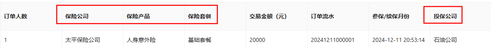

# 1 问题引出
在本次项目中需要用到大量的查询操作，因此不免需要用到多表联查。

而小诺框架对持久层的操作是基于mybatis-plus的，所以多表联查起来很麻烦，在网上有一些解决方案，但还是使用数据翻译比较方便。

在此之前，我还是在Java层面实现的多变联查。比如查询`personnel(p_id,personnel_name,enterprise_id)`，我需要查询`enterprise_id`对应的`enterprise_name`，就需要先分页查询到`personnel(p_id,personnel_name,enterprise_id)`的结果集`personnelListPage`，再迭代遍历`personnelListPage`，挨个获取`enterprise_id`并根据此id字段从另外一个mapper方法中查询到对应的`enterprise_name`，并赋值到`personnelListPage`的单个元素personnel中。

而在使用了`easy trans`的数据翻译后，就只需要在实体类中加上些许注解，就能自动帮我们查询到`enterprise_id`对应的其它字段。原理是组件使用MybatisPlus/JPA的API自动进行查询，把结果放到TransMap中。
# 2 例子
## 2.1 需求说明

如下实体类（我只展示了部分关键字段），我的需求是需要查询所有订单信息，并根据订单表中的产品id和投保公司id，获取该条订单数据的产品信息（买的产品）和投保公司信息（付钱的公司）。

```java
@Getter
@Setter
@TableName(value="t_order")
public class Order{

    /** 订单id */
    @TableId
    @Schema(description = "订单id")
    private String oId;
    
    /** 产品id */
    @Schema(description = "产品id")//alias 加上了就会返回 alias+field的小驼峰名称的字段
    private String prId;
    
    /** 交易金额 */
    @Schema(description = "交易金额")
    private Integer transactionAmount;
    
    /** 投保的公司（就是要被扣钱的公司） */
    @Schema(description = "投保的公司（就是要被扣钱的公司）")
    private String enterpriseId;


    /** 保险公司：推出保险的公司，就是生产者 */
    @Schema(description = "保险公司")
    @TableField(exist = false)
    private String insuranceCompany;
    /** 保险产品 */
    @Schema(description = "保险产品")
    @TableField(exist = false)
    private String productName;
    /** 保险套餐 */
    @Schema(description = "保险套餐")
    @TableField(exist = false)
    private String insurancePackage;
    
    /** 投保公司：买保险的公司，就是消费者 */
    @Schema(description = "投保公司")
    @TableField(exist = false)
    private String enterpriseName;
}
```

## 2.2 字典翻译流程
### 2.2.1 实现TransPojo接口
我们的结果集对应的实体类需要实现TransPojo，代表这个类需要被翻译或者被当作翻译的数据源。并在@TableName注解上加上autoResultMap = true属性，以订单实体为例：
```java
@Getter  
@Setter  
@TableName(value="t_order",autoResultMap = true)  
public class Order implements TransPojo {  
  
    /** 订单id */
    @TableId
    @Schema(description = "订单id")
    private String oId;
    
    /** 产品id */
    @Schema(description = "产品id")//alias 加上了就会返回 alias+field的小驼峰名称的字段
    private String prId;
    
    /** 交易金额 */
    @Schema(description = "交易金额")
    private Integer transactionAmount;
    
    /** 投保的公司（就是要被扣钱的公司） */
    @Schema(description = "投保的公司（就是要被扣钱的公司）")
    private String enterpriseId;


    /** 保险公司：推出保险的公司，就是生产者 */
    @Schema(description = "保险公司")
    @TableField(exist = false)
    private String insuranceCompany;
    /** 保险产品 */
    @Schema(description = "保险产品")
    @TableField(exist = false)
    private String productName;
    /** 保险套餐 */
    @Schema(description = "保险套餐")
    @TableField(exist = false)
    private String insurancePackage;
    
    /** 投保公司：买保险的公司，就是消费者 */
    @Schema(description = "投保公司")
    @TableField(exist = false)
    private String enterpriseName;
}
```

>[!attention] 注意！
>被翻译的数据源对象也要实现TransPojo接口。而这里order需要从enterprise和product表中联查，所需需要给这两个表的实体类上实现TransPojo接口。

```java
@Getter  
@Setter  
@TableName(value = "enterprise",autoResultMap = true)  
public class Enterprise implements TransPojo {  
  
    /** 企业id */  
    @TableId  
    @Schema(description = "企业id")  
    private String eId;  
  
    /** 企业名称 */  
    @Schema(description = "企业名称")  
    private String name;  
}
```

```java
@Getter  
@Setter  
@TableName(value="product",autoResultMap = true)  
public class Product implements TransPojo {  
  
    /** 产品id */  
    @TableId  
    @Schema(description = "产品id")  
    private String prId;  
  
    /** 保险产品名称 */  
    @Schema(description = "保险产品名称")  
    private String productName;  
  
    /** 提供保险产品的公司 */  
    @Schema(description = "提供保险产品的公司")  
    private String insuranceCompany;  
  
    /** 保险产品套餐 */  
    @Schema(description = "保险产品套餐")  
    private String insurancePackage;  
}
```
### 2.2.2 使用@Trans注解
在需要翻译的字段上添加下面一行注解即可：
```java
//Oredr实体类上

/** 投保的公司（就是要被扣钱的公司） */  
@Schema(description = "投保的公司（就是要被扣钱的公司）")  
@Trans(type = TransType.SIMPLE,target = Enterprise.class,fields = "name",ref = "enterpriseName",alias = "enterprise")  
private String enterpriseId;


/** 投保公司：买保险的公司，就是消费者 */
@Schema(description = "投保公司")
@TableField(exist = false)
private String enterpriseName;
```
- type表示翻译类型 -- 简单翻译：TransType.SIMPLE
- target表示要翻译出来的结果字段在哪个表中（对应的实体类）
- fields表示对应翻译的是哪个字段
- ref表示翻译出来的值要赋值到实体类的哪个属性中

如果是要翻译一组字段，就可以像下面的例子一样：
```java
//Oredr实体类上

/** 产品id */  
@Schema(description = "产品id")//alias 加上了就会返回 alias+field的小驼峰名称的字段  
@Trans(type = TransType.SIMPLE,target = Product.class,fields = {"insuranceCompany","productName","insurancePackage"},refs = {"insuranceCompany","productName","insurancePackage"})  
private String prId;


/** 保险公司：退出保险的公司 */  
@Schema(description = "保险公司")  
@TableField(exist = false)  
private String insuranceCompany;  
/** 保险产品 */  
@Schema(description = "保险产品")  
@TableField(exist = false)  
private String productName;  
/** 保险套餐 */  
@Schema(description = "保险套餐")  
@TableField(exist = false)  
private String insurancePackage;
```
- refs表示翻译出来的一组值要赋值到实体类的哪些属性中
### 2.2.3 然后呢？然后就没有了
接下来就用mybatis-plus的分页查询即可。



# 3 扩展学习
## easy trans 支持的五种类型
字典翻译(TransType.DICTIONARY)
需要使用者把字典信息刷新到DictionaryTransService 中进行缓存，使用字典翻译的时候取缓存数据源

简单翻译(TransType.SIMPLE)
比如有userId需要userName或者userPo给前端，原理是组件使用MybatisPlus/JPA的API自动进行查询，把结果放到TransMap中。

跨微服务翻译(TransType.RPC)
比如订单和用户是2个微服务，但是我要在订单详情里展示订单的创建人的用户名，需要用到RPC翻译，原理是订单微服务使用restTemplate调用用户服务的一个统一的接口，把需要翻译的id传过去，然后用户微服务使用MybatisPlus/JPA的API自动进行查询把结果给订单微服务，然后订单微服务拿到数据后进行翻译，当然使用者只是需要一个注解，这些事情都是由组件自动完成的。

AutoTrans(TransType.AUTO)
还是id翻译name场景，但是使用者如果想组件调用自己写的方法而不通过Mybatis Plus/JPA 的API进行数据查询，就可以使用AutoTrans

枚举翻译(TransType.ENUM)
比如我要把SEX.BOY 翻译为男，可以用枚举翻译。