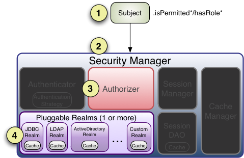

# 一、Apache Shiro 简介
## 1 什么是 Apache Shiro？

Apache Shiro 是一个功能强大且灵活的开源安全框架，可以干净地处理**身份验证**，**授权**，**企业会话管理** 和**加密**。

Shiro 尝试在所有应用程序环境中实现这些目标——从最简单的命令行应用程序到最大的企业应用程序，而不必强加对其他第三方框架，容器或应用程序服务器的依赖。当然，该项目旨在尽可能地集成到这些环境中，但是可以在任何环境中直接使用它。

>不管是在javase还是在c++中或是Spring中都可以方便的使用Shiro进行权限管理相关操作。

## 2 Apache Shiro 功能

如下图，Shiro功能分为两类：主要问题解决、支持的功能


**Primary Concerns：**  
Shiro 以 Shiro 开发团队所谓的“应用程序安全性的四个基石”为目标——身份验证，授权，会话 Management 和密码学：

- **认证：** 有时称为“登录”，这是证明用户就是他们所说的身份的行为。
    
- **授权：** 访问控制的过程，即确定“谁”有权访问“什么”。
    
- **会话 Management：** 即使在非 Web 或 EJB 应用程序中，也 Management 用户特定的会话。
    
- **密码学：** 使用密码算法保持数据安全，同时仍易于使用。
    

**Supporting Features：**  
在不同的应用程序环境中，还具有其他功能来支持和加强这些问题，尤其是：

- Web 支持：Shiro 的 Web 支持 API 可帮助轻松保护 Web 应用程序。
    
- 缓存：缓存是 Apache Shiro API 的第一层公民，可确保安全操作保持快速有效。
    
- 并发性：Apache Shiro 的并发功能支持多线程应用程序。
    
- 测试：测试支持可以帮助您编写单元测试和集成测试，并确保您的代码将按预期进行保护。
    
- “运行方式”：一种功能，允许用户采用其他用户的身份(如果允许)，有时在 Management 方案中很有用。
    
- “记住我”：在整个会话中记住用户的身份，因此他们仅在必要时登录。

# 二、 Apache Shiro 架构

Shiro 的核心设计模拟了大多数人如何在与某人(或某物)进行交互的情况下如何考虑应用程序安全性。

软件应用程序通常是根据**用户案例**设计的。也就是说，*您通常会根据用户与软件的交互方式来设计用户界面或服务 API*。例如，您可能会说：“如果与我的应用程序进行交互的用户已登录，我将向他们显示一个按钮，他们可以单击以查看其帐户信息。如果他们未登录，我将显示一个注册按钮。 ”

## 1 高层次概述

在最高概念级别，Shiro 的体系结构具有 3 个主要概念：`Subject`，`SecurityManager`和`Realms`。


应用程序要被Shiro效验的对象就是Subject，它可以是一个用户也可以是其它需要进行安全管理的对象。真正执行安全操作的是SecurityManager，其封装了大量的安全操作功能。而那些用户信息、权限信息、管理信息等安全信息就都需要通过Realms获取，Realms充当 Shiro 与您的应用程序安全数据之间的“bridge 梁”或“连接器”。

大致流程为：应用程序传递Subject给SecurityManager，然后SecurityManager从Realm中获取安全数据进行安全效验。
>像其他内部组件一样，Shiro `SecurityManager`Management 如何使用领域来获取要表示为`Subject`实例的安全性和身份数据。

## 2 详细结构

下图显示了 Shiro 的核心体系结构概念，并简要概述了每个概念：


- **Subject（主体）**：代表当前用户，可以是一个人、设备或者其他与应用交互的实体。Subject封装了与安全性相关的操作，如身份验证和授权。
    
- **SecurityManager（安全管理器）**：负责管理所有Subject，是Shiro的核心。它协调各种安全[组件](https://edu.csdn.net/cloud/houjie?utm_source=highword&spm=1001.2101.3001.7020)的工作，确保安全性的全面性。
    
- **Realm（领域）**：负责验证Subject的身份，并提供与授权数据交互。可以将Realm看作是安全数据源。
    
- **Authentication（身份验证）**：验证Subject的身份是否合法。通常包括用户名密码验证、多因素认证等。
    
- **Authorization（授权）**：确定Subject是否有权限执行特定的操作。授权是安全框架的另一个关键方面。
    
- **Session Management（会话管理）**：处理用户的会话，确保安全地管理用户的状态信息。
# 三、登录认证

## 1 概念

1. 身份验证：一般需要提供如身份ID等一些标识信息来表明登录者的身份，如提供email、用户名+密码、手机等来证明。
2. 在shiro中，用户需要提供principals（身份)和credentials(证明)给shiro，从而应用程序能验证用户身份：
	1. principals：身份，即主体的唯一标识属性，可以是任何属性，如用户名、邮箱等，唯一即可。一个主体可以有多个principals,但只有一个Primary principals，一般是用户名/邮箱/手机号。
	2. credentials：证明/凭证，即只有主体知道的安全值，如密码/数字证书等。
	3. 最常见的principalsi和credentials组合就是用户名/密码

## 2 登录认证基本流程

1. 收集用户身份/凭证，即如用户名/密码
2. 调用`Subject.login` 进行登录，如果失败将得到相应的`AuthenticationException`异常，根据异常提示用户·错误信息：否则登录成功
3. 创建自定义的Realm类，继承`org.apache.shiro.realm.AuthenticatingRealm`类，实现`doGetAuthenticationInfo()`方法


```ini
[users]  
zs=123456  
ls=654321
```

```java
import org.apache.shiro.SecurityUtils;  
import org.apache.shiro.authc.AuthenticationException;  
import org.apache.shiro.authc.IncorrectCredentialsException;  
import org.apache.shiro.authc.UnknownAccountException;  
import org.apache.shiro.authc.UsernamePasswordToken;  
import org.apache.shiro.ini.IniSecurityManagerFactory;  
import org.apache.shiro.mgt.SecurityManager;  
import org.apache.shiro.subject.Subject;  
  
import java.util.Scanner;  
  
public class Main {  
    public static void main(String[] args) {  
        //获取键盘输入  
        Scanner scanner = new Scanner(System.in);  
        System.out.print("请输入用户名：");  
        String username = scanner.nextLine();  
        System.out.print("请输入密码：");  
        String password = scanner.nextLine();  
  
        //1、初始化获取SecurityManager  
        IniSecurityManagerFactory iniSecurityManagerFactory = new IniSecurityManagerFactory("classpath:shiro.ini");  
        SecurityManager securityManager =  iniSecurityManagerFactory.getInstance();  
        SecurityUtils.setSecurityManager(securityManager);  
        
        //2、获取Subject对象  
        Subject subject = SecurityUtils.getSubject();  
        
        //3、创token对象，web应用用户名密码从页面传递  
        UsernamePasswordToken token = new UsernamePasswordToken(username,password);  
        
        //4、完成登录  
        try {  
            subject.login(token);  
            System.out.println("登录成功!");  
        } catch (UnknownAccountException e) {  
            e.printStackTrace();  
            System.out.println("用户不存在!");  
        } catch (IncorrectCredentialsException e){  
            e.printStackTrace();  
            System.out.println("密码错误!");  
        } catch (AuthenticationException e){  
            e.printStackTrace();  
            System.out.println("认证失败!");  
        }  
    }  
}
```

# 四、角色授权

## 1 授权概述

1. 授权，也叫访问控制，即在应用中控制谁访问哪些资源（如访问页面/编辑数据/页面操作.等)。在授权中需了解的几个关键对象：主体(Subject)、资源(Resource).、权限.(Permission.)、角色(Role)。'
2. 主体(Subject):访问应用的用户，在·Shiro中使用·Subject·代表该用户。用户只有授权·后才允许访问相应的资源。~
3. 资源(Resource):在应用中用户可以访问的·UL,比如访问·JSP·页面、查看/编辑某些·数据、访问某个业务方法、打印文本等等都是资源。用户只要授权后才能访问。·
4. 权限(Permission):安全策略中的原子授权单位，通过权限我们可以表示在应用中用户·有没有操作某个资源的权力。即权限表示在应用中用户能不能访问某个资源，如：访问用·户列表页面查看/新增/修改/删除用户数据（即很多时候都是CUD(增查改删）式权限控·制)等。权限代表了用户有没有操作某个资源的权利，即反映在某个资源上的操作允不允许。
5. Siro·支持粗粒度权限（如用户模块的所有权限）和细粒度权限（操作某个用户的权限，·即实例级别的)
6. 角色(Role):权限的集合，一般情况下会赋予用户角色而不是权限，即这样用户可以拥有一组权限，赋予权限时比较方便。典型的如：项目经理、技术总监、CT0、开发工程师等·都是角色，不同的角色拥有一组不同的权限

## 2 授权方式

- 编程方式

通过手动编写`if else` 代码实现。
```js
if(subject.hasRole("admin")){
	//有权限
}else{
	//无权限
}
```

- 注解方式

通过在执行的Java方法上放置相应的注解完成，没有权限将抛出相·应的异常。
```java
@RequiresRoles("admin")
@RequestMapping("/user/info")
public List<User> userInfo{
	//有权限
}
```

- JSP/GSP.标签

在JSP/GSP.页面通过相应的标签完成

```

<shiro:hasRole name="admin">
<!--有权限-->
</shiro:hasRole>
```


## 3 授权流程



**步骤 1** ：应用程序或框架代码调用`Subject` `hasRole*`，`checkRole*`，`isPermitted*`或`checkPermission*`方法变体中的任何一种，并传入所需的任何权限或角色表示。

**步骤 2** ：`Subject`实例(通常是[DelegatingSubject](http://shiro.apache.org/static/current/apidocs/org/apache/shiro/subject/support/DelegatingSubject.html)(或子类))通过调用`securityManager`几乎相同的`hasRole*`，`checkRole*`，`isPermitted*`或`checkPermission*`方法变体来委派应用程序的`SecurityManager`(`securityManager`实现[org.apache.shiro.authz.Authorizer](http://shiro.apache.org/static/current/apidocs/org/apache/shiro/authz/Authorizer.html)接口，它定义了所有特定于主题的授权方法)。

**步骤 3** ：`SecurityManager`是基本的“伞”组件，通过调用`authorizer`各自的`hasRole*`，`checkRole*`，`isPermitted*`或`checkPermission*`方法来中继/代理到其内部[org.apache.shiro.authz.Authorizer](http://shiro.apache.org/static/current/apidocs/org/apache/shiro/authz/Authorizer.html)实例。 `authorizer`实例默认为[ModularRealmAuthorizer](http://shiro.apache.org/static/current/apidocs/org/apache/shiro/authz/ModularRealmAuthorizer.html)实例，该实例支持在任何授权操作期间协调一个或多个`Realm`实例。

**步骤 4** ：检查每个已配置的`Realm`，以查看其是否实现相同的[Authorizer](http://shiro.apache.org/static/current/apidocs/org/apache/shiro/authz/Authorizer.html)接口。如果是这样，则调用 Realm 各自的`hasRole*`，`checkRole*`，`isPermitted*`或`checkPermission*`方法。

```ini
[users]  
zs=123456,role1  
ls=654321  
  
[roles]  
role1=user:insert,user:delete,user:update
```

```java
import org.apache.shiro.SecurityUtils;  
import org.apache.shiro.authc.AuthenticationException;  
import org.apache.shiro.authc.IncorrectCredentialsException;  
import org.apache.shiro.authc.UnknownAccountException;  
import org.apache.shiro.authc.UsernamePasswordToken;  
import org.apache.shiro.ini.IniSecurityManagerFactory;  
import org.apache.shiro.mgt.SecurityManager;  
import org.apache.shiro.subject.Subject;  
  
import java.util.Scanner;  
  
public class Main {  
    public static void main(String[] args) {  
        //获取键盘输入  
        Scanner scanner = new Scanner(System.in);  
        System.out.print("请输入用户名：");  
        String username = scanner.nextLine();  
        System.out.print("请输入密码：");  
        String password = scanner.nextLine();  
  
        //1、初始化获取SecurityManager  
        IniSecurityManagerFactory iniSecurityManagerFactory = new IniSecurityManagerFactory("classpath:shiro.ini");  
        SecurityManager securityManager =  iniSecurityManagerFactory.getInstance();  
        SecurityUtils.setSecurityManager(securityManager);  
        
        //2、获取Subject对象  
        Subject subject = SecurityUtils.getSubject();  
        
        //3、创token对象，web应用用户名密码从页面传递  
        UsernamePasswordToken token = new UsernamePasswordToken(username,password);  
        
        //4、完成登录  
        try {  
            subject.login(token);  
            System.out.println("登录成功!");  
  
            boolean hasRole = subject.hasRole("role1");  
            System.out.println("是否拥有role1角色："+hasRole);//如果有就可以看到对应的内容  
  
            boolean hasPermission = subject.isPermitted("user:delete");  
            System.out.println("是否拥有user:delete权限："+hasPermission);//如果有就可以执行对应的操作  
  
        } catch (UnknownAccountException e) {  
            e.printStackTrace();  
            System.out.println("用户不存在!");  
        } catch (IncorrectCredentialsException e){  
            e.printStackTrace();  
            System.out.println("密码错误!");  
        } catch (AuthenticationException e){  
            e.printStackTrace();  
            System.out.println("认证失败!");  
        }  
    }  
}
```

# 五、加密

## 1 加密API

```java
//明文密码  
String password = "password123";  
//使用md5加密  
Md5Hash md5Hash = new Md5Hash(password);  
System.out.println("md5普通加密："+md5Hash);  
  
//带盐的md5加密，盐就是在密码明文1后拼接新字符串，然后1再进行加密  
Md5Hash md5Hash2 = new Md5Hash(password, "salt");  
System.out.println("md5带盐加密："+md5Hash2);  
  
//为了保证安全，避免被破解还可以多次迭代加密，保证数据安全  
Md5Hash md5Hash3 = new Md5Hash(password, "salt", 3);//迭代3次  
System.out.println("md5带盐多次迭代加密："+md5Hash3);  
  
//使用父类进行加密  
SimpleHash simpleHash = new SimpleHash("md5", password, "salt", 3);  
System.out.println("父类加密："+simpleHash);
```

```
md5普通加密：482c811da5d5b4bc6d497ffa98491e38
md5带盐加密：5ab3a21114c70538c5574336e91b9dcd
md5带盐多次迭代加密：480172ad69bc2d9b6a168ecff243b26b
父类加密：480172ad69bc2d9b6a168ecff243b26b
```

# 六、自定义登录认证

Siro默认的登录认证是不带加密的，如果想要实现加密认证需要自定义登录认证，自定义Realm。
## 1 自定义登录认证
