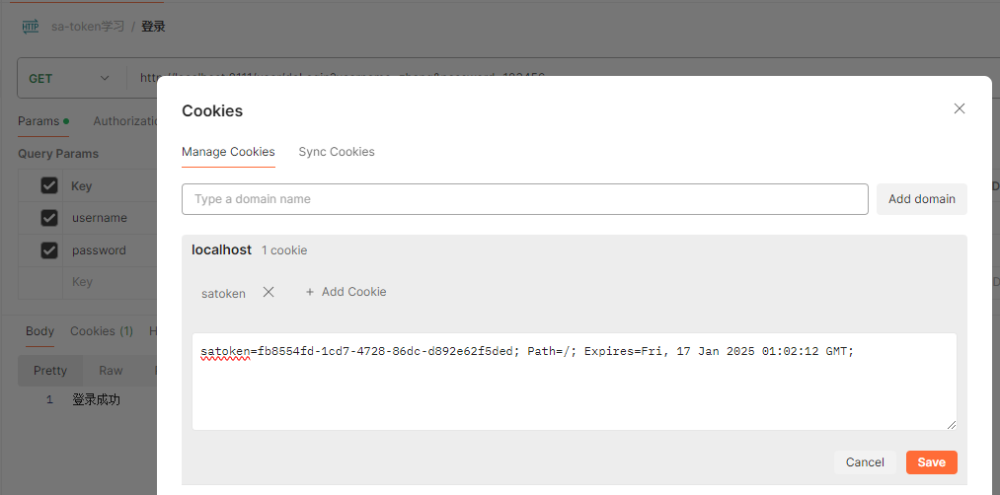
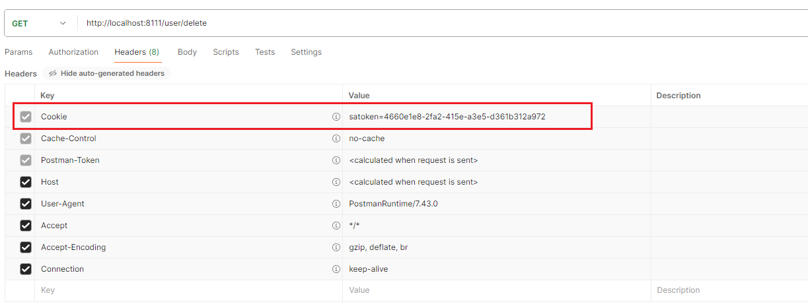
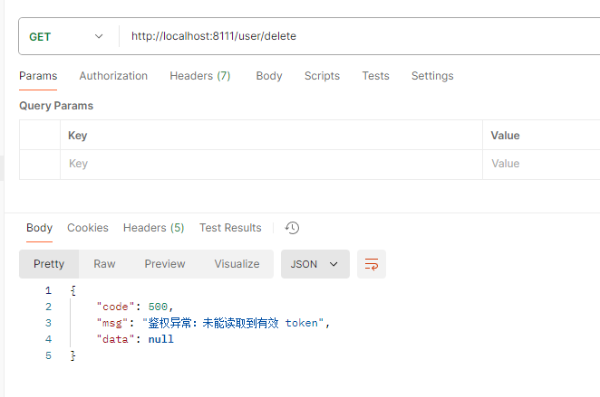
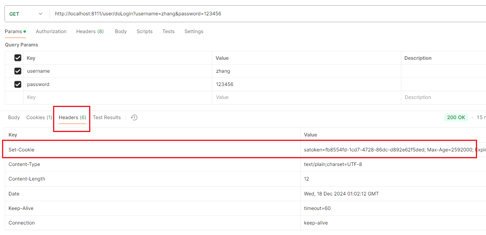
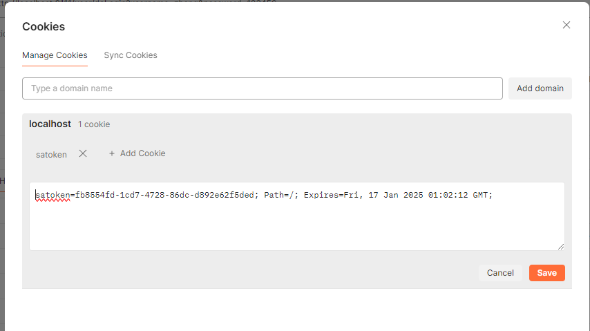
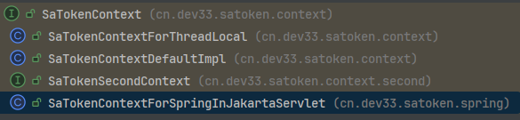

官网地址[框架介绍](https://sa-token.cc/doc.html#/)

# 1 登录认证
sa-token 是依据cookie中是否存储了token，从而判断当前用户是否登录的。官网中是这样解释的（节选）：
- 服务器根据 Token 判断此会话是否登录成功。
- Sa-Token 为这个账号创建了一个Token凭证，且通过 Cookie 上下文返回给了前端。
- Cookie 可以从后端控制往浏览器中写入 token 值。Cookie 会在前端每次发起请求时**自动**提交 token 值。因此，在 Cookie 功能的加持下，我们可以仅靠 `StpUtil.login(id)` 一句代码就完成登录认证。

事实上确实如此，从一个登录接口配合postman的案例就可以说明。

## 1.1 postman案例
- 这是一个非常简单的模拟登录接口，只要你发送的请求参数为`username=zhang&password=123456` 就可以完成登录，并调用`StpUtil.login(id)`方法实现登录认证
```java
@RequestMapping("doLogin")  
public String doLogin(String username, String password) {  
    // 此处仅作模拟示例，真实项目需要从数据库中查询数据进行比对  
    if("zhang".equals(username) && "123456".equals(password)) {  
        StpUtil.login(10001);  
        return "登录成功";  
    }  
    return "登录失败";  
}
```
- 从官网的解释中不难看出sa-token是根据存储在cookie中的token实现独立验证的，在完成登录操作后的postman中就有此token



- 在登录后，再向其它接口发送请求时，就会自动携带cookie的请求头，携带着token，发送给后端



- 如果我这时，将cookie中的token删除再去访问其它需要登录才能访问的接口时就会抛出如下异常（被我的全局异常处理器捕获并将异常信息响应给前端）：

```
全局异常处理器：请登录:cn.dev33.satoken.exception.NotLoginException: 未能读取到有效 token
```




## 1.2 从源码判断
- 我定义了一个UserController，里面有doLogin()请求控制器方法，实现登录，当验证用户和密码成功就调用`StpUtil.login(10001)`方法实现会话登录。
- 而`StpUtil.login(id)` 调用了`StpLogic.login(id)`。StpLogic是Sa-Token 权限认证，逻辑实现的核心类，框架大多数功能均由此类提供具体逻辑实现。
```java
/**  
 * 会话登录  
 *  
 * @param id 账号id，建议的类型：（long | int | String）  
 */  
public void login(Object id) {  
    login(id, new SaLoginModel());  
}
```
- 而`StpLogic.login(id)`又调用了`login(id, new SaLoginModel())`实现会话登录并往客户端注入token
```java
/**  
 * 会话登录，并指定所有登录参数 Model  
 * @param id 账号id，建议的类型：（long | int | String）  
 * @param loginModel 此次登录的参数Model   
 */  
public void login(Object id, SaLoginModel loginModel) {  
    // 1、创建会话   
	String token = createLoginSession(id, loginModel);  
  
    // 2、在当前客户端注入 token    
    setTokenValue(token, loginModel);  
}
```
- 往客户端注入token的方式有多种，具体可以看`StpLogic.setTokenValue()`的实现：
```java
public void setTokenValue(String tokenValue, SaLoginModel loginModel){  
  
    // 先判断一下，如果提供 token 为空，则不执行任何动作  
    if(SaFoxUtil.isEmpty(tokenValue)) {  
       return;  
    }  
      
    // 1、将 token 写入到当前请求的 Storage 存储器里
    //Storage：st-token自定义的请求作用域，作用于当此请求（实际上就是Request对象）  
    setTokenValueToStorage(tokenValue);  
    
    // 2. 将 token 写入到当前会话的 Cookie 里  
    //在手动删除或失效前一直存在于客户端
    if (getConfigOrGlobal().getIsReadCookie()) {  
       setTokenValueToCookie(tokenValue, loginModel.getCookieTimeout());  
    }  
      
    // 3. 将 token 写入到当前请求的响应头中 
    //根据配置选项决定是否写入，默认是不写入的
    if(loginModel.getIsWriteHeaderOrGlobalConfig()) {  
       setTokenValueToResponseHeader(tokenValue);  
    }  
}
```

- 可以看到如下postman示例，往登录接口发送登录请求，用户和密码验证成功后响应头中有了set-Cookie的请求头，值就是	`satoken=xxxxx` 


- 而在postman中的cookies中也可以看到该token



>[!note] Cookie实际上就是一个header：
>Cookie信息主要是通过HTTP响应头（Set-Cookie）由服务器发送给客户端，并保存在客户端。在后续的HTTP请求中，客户端会**默认**通过HTTP请求头（Cookie）将这些信息发送回服务器。
>Cookie信息在HTTP请求头和响应头中通常以“名/值”对（name-value pairs）的形式存在，这与普通的header参数格式一致。

- 具体通过Java代码实现cookie注入的方式就是通过Response对象实现对cookie的写入操作

```java
public void setTokenValueToCookie(String tokenValue, int cookieTimeout){  
    SaCookieConfig cfg = getConfigOrGlobal().getCookie();  
    SaCookie cookie = new SaCookie()  
          .setName(getTokenName())  
          .setValue(tokenValue)  
          .setMaxAge(cookieTimeout)  
          .setDomain(cfg.getDomain())  
          .setPath(cfg.getPath())  
          .setSecure(cfg.getSecure())  
          .setHttpOnly(cfg.getHttpOnly())  
          .setSameSite(cfg.getSameSite())  
          ;  
    SaHolder.getResponse().addCookie(cookie);  
}
```

## 1.3 SaTokenContext
- sa-token是怎么获取Response对象的呢？
- 为什么直接调用`SaHolder.getResponse()`这个api就能获取Response对象呢？

>[!note] 官方解释：
SaHolder：Sa-Token 上下文持有类，你可以通过此类快速获取当前环境下的 SaRequest、SaResponse、SaStorage、SaApplication 对象。  
>实际上就是返回SaTokenContext实现类封装的Response对象。

这就要看到saTokenContext了。[自定义 SaTokenContext 指南](https://sa-token.cc/doc.html#/fun/sa-token-context)

>[!note] 官方解释：
在鉴权中，必不可少的步骤就是从 `HttpServletRequest` 中读取 Token，然而并不是所有框架都具有 HttpServletRequest 对象，例如在 WebFlux 中，只有 `ServerHttpRequest`， 在一些其它Web框架中，可能连 `Request` 的概念都没有。
>
>那么，Sa-Token 如何只用一套代码就对接到所有 Web 框架呢？
>
>解决这个问题的关键就在于 `SaTokenContext` 接口，此接口的作用是屏蔽掉不同 Web 框架之间的差异，提供统一的调用API。

而在idea中查看SaTokenContext的继承关系可以发现有多个实现类：



>其中，SaTokenContextForThreadLocal就是通过`ThreadLocal`获取Response、Request等对象；  
>SaTokenContextForSpringInJakartaServlet是通过Spring提供的api获取Response、Request等对象；  
>SaTokenContextDefaultImpl是默认的实现类，如果走到这里一般都是有问题了，会抛出异常。  
>如果没有符合自己需要的实现类，那就可以自己去实现SaTokenContext这个接口即可，[自定义 SaTokenContext 指南](https://sa-token.cc/doc.html#/fun/sa-token-context)。

而我的项目是基于SpringBoot的Servlet项目，所以需要看SaTokenContextForSpringInJakartaServlet这个实现类。

结合[他人的博客](https://blog.csdn.net/weixin_39570751/article/details/121291274)，扒到最低层，发现基于springboot的web项目中，是通过spring提供的api获取的Response。
```java
public static HttpServletResponse getResponse() {  
    ServletRequestAttributes servletRequestAttributes = (ServletRequestAttributes)RequestContextHolder.getRequestAttributes();  
    if (servletRequestAttributes == null) {  
        throw (new NotWebContextException("非 web 上下文无法获取 HttpServletRequest")).setCode(20101);  
    } else {  
        return servletRequestAttributes.getResponse();  
    }  
}
```
再扒下去就要看spring源码了，所以先在此打住。

## 1.4 登录总流程
在执行`StpUtil.login(id)`之后，sa-token做了什么
- 请求控制器里调用了`StpUtil.login(10001);`
- 步入：StpUtil.login(id)。权限认证工具类
- 步入：StpLogic.login(id)。权限认证，逻辑实现类
- 调用：`StpLogic.login(id, new SaLoginModel())`。此时SaLoginModel还未初始化
	- SaLoginModel：登录时的配置参数，决定登录的一些细节行为。如设备类型、cookie有效期、本次登录的token有效期等。
	- 此方法主要做两件事，创建会话和在当前客户端注入token
		- `createLoginSession()`：
			- 1、先检查传入参数是否有效，再初始化loginModel（根据配置文件初始化）；
			- 2、然后给这个账户分配一个可用的token（依据框架的配置生成）；
			- 3、创建基于此账号id的 Account-Session ；
			- 4、在 Account-Session 上记录本次登录的 token 签名；
			- 5、保存 token -> id 的映射关系，方便日后根据 token 找账号 id；
			- 6、写入这个 token 的最后活跃时间；
			- 7、发布全局事件：账号 xxx 登录成功；
			- 8、检查此账号会话数量是否超出最大值，如果超过，则按照登录时间顺序，把最开始登录的给注销掉；
			- 9、一切处理完毕，返回会话凭证 token；
		- `setTokenValue()`
			- 1、将 token 写入到当前请求的 Storage 存储器里
			- 2、将 token 写入到当前会话的 Cookie 里
			- 3、将 token 写入到当前请求的响应头中
```java
public void login(Object id, SaLoginModel loginModel) {  
	// 1、创建会话   
	String token = createLoginSession(id, loginModel);  
  
	// 2、在当前客户端注入 token    
	setTokenValue(token, loginModel);  
}
```

## 1.5 其它api
```java
/*---------------登录相关--------------*/
//登录
StpUtil.login();//如果可用用非法手段获取到StpUtil，岂不就是想登录就登录了？连登录接口都可以不访问。

// 当前会话注销登录
StpUtil.logout();

// 获取当前会话是否已经登录，返回true=已登录，false=未登录
StpUtil.isLogin();

// 检验当前会话是否已经登录, 如果未登录，则抛出异常：`NotLoginException`
StpUtil.checkLogin();

/*---------------会话相关--------------*/

// 获取当前会话账号id, 如果未登录，则抛出异常：`NotLoginException` 
StpUtil.getLoginId();

/*---------------token相关--------------*/

// 获取当前会话的 token 值
StpUtil.getTokenValue();

// 获取当前`StpLogic`的 token 名称
StpUtil.getTokenName();

// 获取指定 token 对应的账号id，如果未登录，则返回 null
StpUtil.getLoginIdByToken(String tokenValue);

// 获取当前会话剩余有效期（单位：s，返回-1代表永久有效）
StpUtil.getTokenTimeout();

// 获取当前会话的 token 信息参数
StpUtil.getTokenInfo();
```

# 2 权限认证

所谓权限认证，核心逻辑就是判断一个账号是否拥有指定权限。

例如点击页面中的删除用户按钮，就会发送删除用户请求，当后端接收到此请求后就会验证当前登录用户的权限列表里是否有此权限，如果有就允许删除否则就阻止操作。

如果需要，还可以和前端配合，根据不同用户的不同权限，显示不同的页面内容。例如拥有全部权限的超级管理员就可以看到系统设置菜单栏，而普通用户则看不到系统设置菜单栏。

所以现在问题的核心就是两个：

1. 如何获取一个账号所拥有的权限码集合？
2. 本次操作需要验证的权限码是哪个？

## 2.1 获取当前账号权限码集合


##
```java
	/**
	 * 获取当前请求的 token 值 （不裁剪前缀）
	 *
	 * @return / 
	 */
	public String getTokenValueNotCut(){

		// 获取相应对象
		SaStorage storage = SaHolder.getStorage();
		SaRequest request = SaHolder.getRequest();
		SaTokenConfig config = getConfigOrGlobal();
		String keyTokenName = getTokenName();
		String tokenValue = null;
		
		// 1. 先尝试从 Storage 存储器里读取
		if(storage.get(splicingKeyJustCreatedSave()) != null) {
			tokenValue = String.valueOf(storage.get(splicingKeyJustCreatedSave()));
		}
		// 2. 再尝试从 请求体 里面读取
		if(tokenValue == null && config.getIsReadBody()){
			tokenValue = request.getParam(keyTokenName);
		}
		// 3. 再尝试从 header 头里读取
		if(tokenValue == null && config.getIsReadHeader()){
			tokenValue = request.getHeader(keyTokenName);
		}
		// 4. 最后尝试从 cookie 里读取
		if(tokenValue == null && config.getIsReadCookie()){
			tokenValue = request.getCookieValue(keyTokenName);
		}
		
		// 5. 至此，不管有没有读取到，都不再尝试了，直接返回（也就是null）
		return tokenValue;
	}
```

